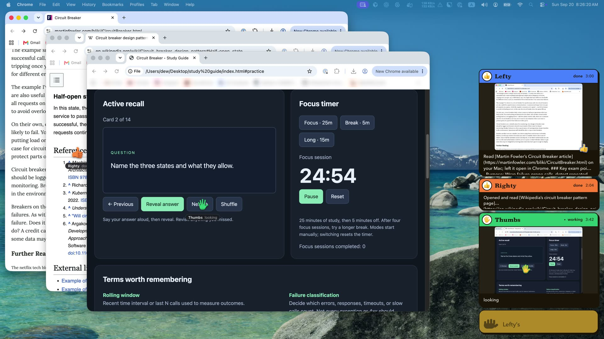
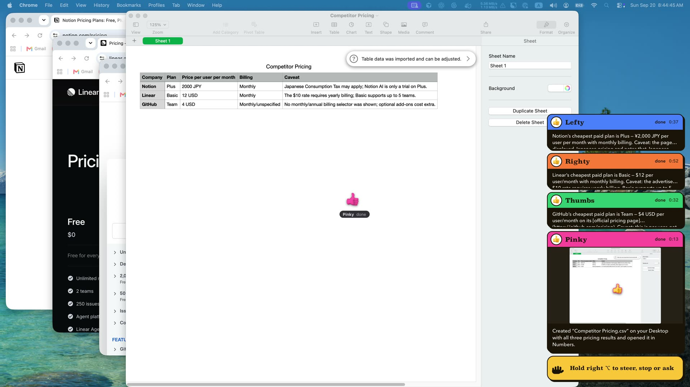
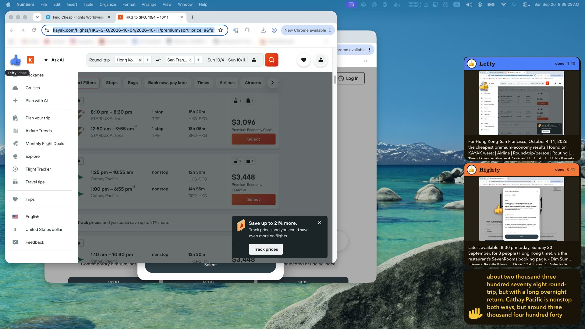

# hands

Hands lets you offload your day (flights, food orders, catching up on X) to a fleet of voice-driven computer use AI agents.

Hold a key, say what you want done, and let go. Up to eight AI hands do it in your real Mac apps and your own Chrome, behind your windows, while you keep working.

Built by team PUK for the General Learning Hackathon. It covers all three tracks: automate your studies, your last job, and your life.



## The problem

The small jobs around learning and work eat the day: looking things up, comparing prices, booking, compiling a list, copying numbers into a spreadsheet. Agents that use a computer could take these over, but today they borrow the whole machine. They move your mouse, type on your keyboard and take your screen, or they run in a cloud sandbox that has none of your apps and none of your logins. Either way you end up watching an agent work.

## What hands does

- **You talk, it delegates.** Hold the right Option key (left Ctrl on Windows) and speak. A full-duplex voice model (OpenAI's gpt-live-1) answers in a few words and sends out hands: one, or several at once when the parts are independent. When a hand finishes, the voice tells you what it found. "Tell Lefty to also check Friday", "stop Righty" and "how are they getting on?" work too.
- **Each hand is an agent with a window of its own.** It reads, clicks, types and scrolls in that one window, through macOS accessibility (UI Automation on Windows) and events addressed to that window alone. Your cursor never moves and your keyboard stays yours, but for the rare action that cannot be done from behind, which borrows them for a moment and gives them back. It works in the apps and the logins you already have, so no site needs an integration.
- **You can see every hand.** Each is a named, coloured hand on the screen, riding the window it works in: it glides to what it clicks, scribbles when it types, swipes when it scrolls. A panel in the corner shows a live picture of every hand's window, what it is doing this moment, its transcript, and a box to steer it.

## Three demos, one for each track

Each is one spoken request, recorded in one take on the machine this was built on. The times are the hands' own.

**Automate your studies.** "I have an exam tomorrow on the circuit breaker pattern. Use three hands…" Two hands read Martin Fowler's article and the Wikipedia page while the third wrote a study site with 14 flashcards and a Pomodoro timer, and opened it: two minutes. Then, by voice: "Thumbs, start the focus timer and flip to the next flashcard", which the hand that built the page did on the page. That is the picture above.

**Automate your last job.** The Monday chore of checking what competitors charge. Three hands read the pricing pages of Notion, Linear and GitHub at the same time (32 to 52 seconds each). "Now save those three as a CSV and open it in Numbers" took a fourth hand 13 seconds.



**Automate your life.** One sentence, two hands: the cheapest premium-economy flights from Hong Kong to San Francisco for 4 to 11 October (found on KAYAK in 1 min 40 s), and the latest table for three today at Dim Sum Library (8:30 pm, found in 41 s). Nothing was booked: hands are told not to book, buy or send anything unless asked, and never to type a password.



## How it works

```
 you ── hold right ⌥ and speak ──►  the voice: gpt-live-1, full duplex, one session
                                      │  a Responses backend turns what was said into six tool calls:
                                      │  start_hands · steer_hand · stop_hands · close_hands · get_hands · remember
                                      ▼
                            hands, 1 to 8: each a process of its own (a pi agent)
                                      │  sees   Vision OCR + the accessibility tree ─► one numbered list, on device
                                      │  acts   AXPress · keys posted to one process · pointer events for one window
                                      │         · for the little that needs it, your mouse and keyboard, borrowed
                                      ▼
                     your Mac apps and your own Chrome profile, behind your windows
                                      │
                                      └──►  the panel: each window live · transcript · steer box · the voice's captions
```

- **Models where they fit.** A realtime voice model for the conversation, a reasoning model behind it for delegation, and for each hand any provider [pi](https://github.com/earendil-works/pi) supports (a ChatGPT subscription signed in with `pi` works with no key of its own). Seeing is not a model call at all: a hand reads a window as text, from on-device OCR and the accessibility tree, and acts by index. A screenshot goes to the model only when text falls short.
- **The cheapest step.** `clicker` is a port of [typesafe-computer-use](https://github.com/awlevin/typesafe-computer-use): a small [TypeSafe](https://docs.typesafe.ai) classifier picks the next action from that numbered list, and stops when it is unsure. Its author measured $0.0002 a decision, 155x cheaper than a frontier model reading the screenshot, with 14x to 40x lower model latency (3.7x faster for a whole step). Those are the original's figures, for this loop, which `bun clicker` runs on its own; a hand hands it one small step at a time as its `clicker` tool, where it works from behind as the hand does.
- **All native, all TypeScript.** Quartz, accessibility, Vision, AppKit, Core Animation, WebKit, AVFAudio and the window server's private SkyLight are called through `bun:ffi`: no compiler, no helper binary, no Electron (on the Mac; Windows has one helper, which it builds itself: see [Windows](#windows)). The on-screen hand costs about 1% of a core, and a picture of a hand's window takes about 7 ms.
- **Measured, not assumed.** With the user working in another app throughout, a three-minute task (search arXiv, keep four papers as tabs, build a PDF, attach it to a new Apple Note) had Notes in front in 0 of 655 samples. 365 tests cover the pure logic and the Windows layer's promises. A dropped connection or a crashed renderer does not end a run.

```
bun live                              # hold right Option (left Ctrl on Windows), and say it
bun hands "prompt"                    # one hand, no voice
```

The rest of this page is the reference: how to install it, every command, and how each part works and what it cost to get there.

## What is in the box

- **`live`** is the voice, the panel, and the hands it sends out.
- **`hands`** is a [pi](https://github.com/earendil-works/pi) agent (`pi-agent-core`) that has pi's coding tools (`read`, `bash`, `edit`, `write`) and computer use side by side: perception and actions as individual tools, and `finish`, which ends each task as done, needs you, or could not.
- **`clicker`** is the port: it drives a Mac toward a goal you type in plain English. It reads the screen deterministically (Vision OCR plus the accessibility tree), asks a TypeSafe classifier (Jev) which action comes next, and only calls a writing model when a field genuinely needs free text. A hand uses the same loop as a tool, in its own window and from behind: one small step (a click-through, one search box with the text to type), after which it reads the window's listing and goes on.

```
bun hands "Open up the calculator and check for me what 1337*1337 with it"   # while you keep working
bun clicker "open the Playground" --act
```

## Install

macOS 14 or newer on Apple Silicon or Intel, or Windows 11 (see [Windows](#windows)), and [Bun](https://bun.com) 1.4 or newer.

```
bun install
echo 'TYPESAFE_API_KEY=...' > .env     # Bun loads .env on its own
echo 'OPENAI_API_KEY=...' >> .env      # only for `bun live`: the voice is OpenAI's gpt-live-1
pi                                     # then /login, once: signs in the model provider
```

The language model goes through [pi-ai](https://github.com/earendil-works/pi/tree/main/packages/ai) and reuses pi's credential store (`~/.pi/agent/auth.json`), so an OpenAI Codex (ChatGPT) subscription signed in with `pi` works here with no key of its own.

| variable | default | purpose |
|---|---|---|
| `TYPESAFE_API_KEY` | required | every clicker decision |
| `HANDS_MODEL` | `openai-codex/gpt-6-astra` | the agent's model, as `provider/model` |
| `HANDS_THINKING` | `low` | reasoning effort, for the agent and the writer |
| `HANDS_SERVICE_TIER` | `priority` | sent as `service_tier`; `off` sends none |
| `CLICKER_WRITER_MODEL`, `CLICKER_ANSWER_MODEL` | `HANDS_MODEL` | the clicker's per-step writer, and the reader of its last screen |
| `CLICKER_BROWSER` | `Google Chrome` | any Chromium browser with Chrome's scripting dictionary |
| `CLICKER_EMAIL` | none | enables the clicker's `type_email` action, offered only for a goal that asks for an email, a username or a sign-in, and no text given |
| `OPENAI_API_KEY` | required by `bun live` | the voice |
| `HANDS_LIVE_MODEL`, `HANDS_LIVE_VOICE`, `HANDS_LIVE_BACKEND` | `gpt-live-1`, `marin`, `gpt-5.6-luna` | the voice, how it sounds, and the Responses model behind it that turns what was said into tool calls |
| `HANDS_WEB` | `jev` | where a task the voice sends out goes (see [Lookups](#lookups)): `jev` lets Jev decide between a web lookup and a hand, `off` sends every task to a hand and gives hands no `web` tool, `always` looks every task up first |
| `HANDS_SPARE` | on | `off`: `bun live` keeps no spare hand's process loaded, and each new hand starts its own |
| `HANDS_REFLEXES` | on | `off` stops Jev's [reflexes](#reflexes): a page that needs you, a cookie banner turned down, a done answer checked against the last screen |
| `HANDS_WEB_MODEL`, `HANDS_LOCATION` | `gpt-6-luna` (then `gpt-5.6-luna` if the account lacks it), none | the model that answers from a web search, and roughly where you are for one, as `Hong Kong` or `Hong Kong, HK` (the time zone always goes with it) |
| `HANDS_WORK`, `HANDS_PROFILE` | `~/Documents/Hands`, `~/.hands/profile.md` | where `bun live`'s hands work, and what the voice knows of you (names as they are spelled), which it adds to |
| `HANDS_KEY`, `HANDS_DESKTOP`, `HANDS_RECORDABLE` | `left-ctrl`, unset, unset | Windows only: the talk key, a virtual desktop per hand, and the hands and panel left in screen recordings |
| `HANDS_SCREEN` | `0` | which display `bun live` sets itself up on: `1` puts the panel on the second display and lays each hand's browser window out there in a cascade, which is how the demos were filmed |
| `HANDS_TAPE` | none | a WAV file to write on Ctrl-C with both sides of the conversation as they were heard, for laying under a screen recording (which hears nothing of a voice in headphones) |
| `HANDS_SAY` | none | a text file: on `SIGUSR1`, `bun live` says its words to the voice as if the key were held, so a take can be directed from a script |

Grant your terminal **Screen Recording** and **Accessibility** in System Settings > Privacy & Security (and **Microphone**, for `bun live`), and let it control your browser the first time macOS asks. Without the first, captures are wallpaper. Without the second, synthetic clicks are silently dropped, and both commands refuse to drive the machine. Windows asks for nothing.

## Use

```
bun hands "prompt"                                   # one task, in any app or site, behind your windows
bun hands --name Lefty --color 4f8cff "prompt"       # the hand on screen: its name and colour (--no-hand runs without one)
bun hands                                            # a prompt per line, same conversation
bun live                                             # hold right Option (left Ctrl on Windows), say what you want, and hands go and do it
bun live --quiet --say "open the calculator and work out 12 times 12"   # the same without a microphone or a speaker
bun clicker "open the Playground"                    # dry run: one step, prints what it would do
bun clicker "open the Playground" --act              # drives the machine, up to 100 steps
bun clicker "log in" --act --steps 20 --delay 3      # longer and slower
bun clicker-inspect "any goal"                       # 3-2-1, capture, open the annotated screen + payload
```

**Stopping a live run.** Ctrl-C, or slam the mouse into the top-left corner of whichever screen it is on. The clicker also stops itself once the screen shows the goal met (Jev's `goal_met` at 0.8, or 0.5 when it also says `done`), on `none` or a pick it is unsure of (the kind under `--min-confidence`, 0.4; the item under 0.5; the field under 0.3), on a loop (the same action three times with no change on screen, four actions of any kind without one, or two refused in a row), on a click whose label commits something (send, buy, delete...), typing that Return submits, or Return itself, when Jev's consequence check flags it, on a blank page, or at `--steps`. In `bun live`, Ctrl-C dismisses every hand first.

**One mode: behind first, the seat when needed.** A hand works behind your windows, and everything it does names its window (see [Behind your windows](#behind-your-windows)), so your mouse, keyboard and focus stay yours. What cannot be done from there borrows the seat, your real mouse and keyboard, for that one action, and gives it back: a right click; on Windows also a shortcut, a drag outside a web page, and typing into Office (see [Windows](#windows)); and an action retried with `seat=true` because from behind it had no effect. `--background` is still accepted, and changes nothing. `bun clicker` is the exception: like the original, it works the screen in front of you with your own mouse and keyboard, so leave it alone while it runs.

## The hand

While it runs, the agent is on screen: an emoji hand with its name on a tag underneath, riding on the window it is working in.

| it is | the hand |
| --- | --- |
| starting, or taking a new prompt | 👋 waves, top right of the main display, with the prompt on its tag (under `bun live` on Windows, over the window it first looks at) |
| reading the window (`screen`) | 🖐️ sweeps over it: `looking` |
| waiting on the model, or running a shell or file tool | 👆 bobs: `thinking`, `bash “…”` |
| clicking or pressing | 👆 glides there on a slight arc, taps, and a ring spreads from the fingertip: `click “Sign in”` |
| typing, or writing a file | ✍️ scribbles: `typing “…”` |
| drawing or dragging | ✍️ the pen's point follows the pointer event for event, so the ink comes out of it |
| pressing keys | 👇 taps once per chord |
| scrolling | ✌️ two fingers swipe the way a trackpad would |
| opening an app or a page | 👉 `opening Notes`, `open arxiv.org/…` |
| waiting | ✋ |
| waiting for, then using, your mouse and keyboard (Windows) | above everything, a turning ring of dashes: `waiting for you to pause`; then rings pulse round it: `using your mouse & keyboard` |
| finished, or stopped | 👍 or ✋, which lingers a moment after the process has gone, then fades |

- **Attached to the window.** The hand belongs to the window being worked: it is stacked directly above that window in the window server's order (`orderWindow:relativeTo:` takes another app's window number), so whatever of yours covers the window covers the hand too, and it follows the window when it moves, leaves with it when it is minimized or on another desktop, and is put back above it within a frame or two if the window is raised past it. Its coordinates are the capture's own, from the window's corner, so the fingertip lands on the control being pressed. Before a hand has a window of its own it can only read your screen, and then it rides on the display, above everything.
- **Any colour.** `--color 4f8cff` (or `'#4f8cff'`, or `HANDS_COLOR`) makes the hand, and the ring it taps with, that colour; without it the hand is the emoji's own yellow. Colour emoji are pictures, so there is no colour to set: each glyph is set in type, photographed into a bitmap, and every pixel given the tint at the brightness it had. The shading survives, the pen stays black, and the skin comes out the colour asked for.
- **It never gets in the way, and it is in your recordings.** The window ignores the mouse, cannot take the focus, and belongs to a process with no Dock icon. The agent must not see its own hand: it would cover the very thing it points at, and its tag would be read back as text. A window is captured by id, which leaves the hand out anyway. A display capture would not, so for exactly as long as one of those takes, the hand's window tells the window server to leave it out of captures, and the agent waits to hear that it has before it shoots (measured: out of 12 of 12 of the agent's captures, in every capture between them). So a screen recording on a Mac shows the hand throughout, but for a blink at each look at the whole screen, which a hand takes only before it has a window of its own. The window also declares itself 99% opaque, which no eye can tell, so that the check for "is my browser window covered?" knows to look through it.
- **How it is drawn.** `src/hand.ts` spawns itself as a second process and sends it one JSON cue per line. That process is an AppKit app driven from `bun:ffi` like everything else here: a transparent window the size of the display, and a few Core Animation layers (the glyph, the ring, the tag). Core Animation plays every motion inside the window server, so nothing draws frames and an idle hand costs about 1% of a core. It is a process of its own because the agent's thread stalls for a second at a time in OCR and tree walks, and because a fault in a drawing must never end a run: if the renderer dies, the cues become no-ops. All timing is the agent's side. A press no longer waits out the glide (160 to 520 ms): the hand glides there as the press goes, since what a hand does behind your windows is seen on its card, and the wait cost every click.

## Live: hold a key and say it

`bun live` is the whole thing in one gesture. Hold the **right Option** key (on Windows, left Ctrl: see [Windows](#windows)), say what you want done, let go. A voice hears it, answers in a few words, and sends out hands: one, or several at once when the parts are independent ("open the calculator and work out twelve times twelve, and have another hand find the top story on Hacker News" is two hands, working side by side, each with its own name and colour). When a hand finishes, the voice tells you what it found; when it needs you (a login, a payment, a choice that is yours), what you must do; when it couldn't finish, why.

- **The panel.** In the bottom right corner, one card per hand, headed in that hand's glove colour (the colour its hand wears out on the screen): a live picture of the window it is working in, with its hand drawn over the picture where the real one is, and under it what it is doing this moment, or what came of it. A hand that needs you stands first, with its question; done shows a check, couldn't finish says why in red, stopped is grey, paused hatched, and a hand using your mouse and keyboard says so. Up to eight hands can be out; as they pile up, the cards that matter least fold down to their headers, so the column always fits the screen, and **Clear done** closes the finished ones. Click a card for its sheet: what it was told, every tool call as a verb and what it was done to, what it said, and a box to tell it something; `↵` sends, `esc` goes back, `⌘W` (Ctrl+W on Windows) closes the hand for good from an empty box, and there are buttons to pause, resume, stop, show and close. A card whose window you have in front folds with an "in front" chip, since then you are looking at the real thing; on Windows, **Show** brings a hand's window to you.
- **The dock.** Under the cards, the voice, in the yellow of the hand emoji itself, and nothing else in the panel is that yellow. While you hold the key it opens up with your words in large type as they are heard, and the fingers of its hand rise with your voice; they drum while it thinks; and when it answers, the same two colours turn the other way round, so you can tell who is talking without reading a label. A banner over its words says when a hand is using your mouse and keyboard or waiting for you to pause. The type is what ships with every Mac (Superclarendon for names, Avenir Next for what is read) and every Windows (Sitka and Segoe UI Variable), so nothing is fetched.
- **Click a hand to stop it where it is.** The hand on the screen can be clicked: it stops in its place, its card opens, and the box has the keyboard, so you can type what it should do instead. An empty `↵`, or Resume, lets it carry on.
- **Or say it.** "Tell Lefty to also check Friday." "How are the hands getting on?" "Stop Righty." "Close them all." The voice always knows who is out and on what, and asks its backend how they are getting on. Tell it how a name is spelled and it remembers, in `~/.hands/profile.md`.
- **Or type it.** Click the dock and type: Jev reads the line in about a third of a second (`src/intent.ts`, one TypeSafe request: what is asked, and of which hand), with no model in between. A new task goes out as a spoken one does (a lookup or a hand); "Lefty, only direct flights" steers Lefty; "stop righty", "pause", "carry on everyone", "show me Lefty" and "clear the finished ones" do what the card's buttons do; "how's it going?" is answered in the dock, a line per hand. A line Jev is not sure of is a new task, as every typed line was before. On 70 labelled lines against made-up sets of hands, 140 of 140 readings over two rounds were right, median 0.32 s. The voice hears of what was typed and what came of it.

How it is put together (`src/live.ts` is the wiring, and none of the three parts knows of the others):

- **The voice** is one `gpt-live-1` session over the `openai` library's `LiveWS`, and the loop is the one in OpenAI's guides with nothing built on top of it. `session.start` names the model, the voice, PCM at 24 kHz, the conversation instructions, and **Responses delegation**: a backend model (`gpt-5.6-luna`) with six function tools, `start_hands`, `steer_hand`, `stop_hands`, `close_hands`, `get_hands` and `remember`. gpt-live-1 is full duplex and "manages when to listen and speak as audio streams continuously", so an open session is sent `session.input_audio.append` without a break, at the pace it was recorded: the microphone while the key is held, silence while it is not. The key is this application's control of its own microphone; when you have finished, what you want, and whether to delegate it are the model's to decide, from the audio. Its speech, `session.output_audio.delta`, is queued for playback in order (not while the key is held, and what is queued is dropped when the key goes down: that is talking over it). The backend's tool calls arrive as nested `response.event`s: a call is whole at `response.output_item.done`, and when the response is `completed` every call is carried out here, answered with `response.item.create` (a `function_call_output`), and the response continued with `response.create`. Transcript deltas are captions, and nothing else.
  - *The voice is told when something happens, and only then*, with the two documented appends: `session.commentary.append`, which it speaks, when a hand finishes, needs you or couldn't finish, and not while anyone is talking; `session.thinking.append`, which it only knows, when a hand is stopped, paused or dismissed. How the hands are getting on it asks the backend, whose `get_hands` looks. The backend's instructions are updated with `session.update` whenever who is out changes.
  - *Cost and lifetime*: an open session costs $0.05 a minute, so after a minute with nothing said (and not within 15 s of being given something to say) it is closed the documented way (`session.close`, then `session.closed`), and started again when the key is next held (what is said meanwhile is buffered through the connection, as the guide suggests) or a hand has something to report. A session started again is told the conversation's last turns and how the hands stand; they outlive sessions.
  - *Two things learned the hard way, both by departing from the guides*: a note sent just as the user finishes a sentence gets in the way of the voice deciding what to do with it (it then delegated one turn in five by itself; left alone, five in five); and anything that guesses at turns, mutes and unmutes around them, sends audio in bursts, or second-guesses whether the voice "really" delegated makes it worse, not better. An earlier version did all of those.
- **The hands** are ordinary `hands --json` processes, up to eight, each with a run folder of its own (`lefty`, then `lefty-2`), working in `~/Documents/Hands`. `--json` makes a hand something another program can run: commands in on stdin (`prompt`, `steer`, `pause`, `resume`, `stop`, `close`), and on stdout a JSON line for everything it does: each tool call and result, what it says, every cue its on-screen hand is sent (which is how the panel draws that hand, and knows its window), a click on the hand, and how each run ended: `done`, `needs_you`, `failed` with a reason, `stopped` or `paused`. A `steer` to a working hand is queued by pi and read after its current turn; to an idle one it is a new prompt in the same conversation. A hand whose process ends without being dismissed has failed, with the last lines of its `stderr.log` as the reason; a dismissed one is told to `close`, and ended if it has not gone in 2 s. One more process is kept ready (`--spare`): loaded, its Windows helper started, waiting for a first line that tells it who it is. A new hand takes it instead of starting a process, which took 1.4 s before it could ask the model anything, most of it loading (ready 50 ms after the handover; a trivial task done in 1.4 to 1.7 s against 3.0 to 3.3). Each hand's requests to OpenAI carry a prompt cache key of its name, and the system prompt keeps the time at its end, so each new Lefty finds the last one's 5k-token prefix in the provider's cache (5 of 6 first turns, median 1.74 s against 2.0 s).
- **The shell** (`src/shell.ts` on a Mac; Windows' is under [Windows](#windows)) is the key, the microphone, the speaker, the panel and a camera, all bun:ffi with no thread of its own: AppKit, WebKit and the microphone's AudioQueue deliver on the main run loop, which is the JS thread, pumped on a timer. The key is polled, so there is no event tap and no permission, and it is read from the modifier flags (`CGEventSourceFlagsState`, where each side's Option has a bit of its own: the key-state table never shows a modifier as down); a keystroke while Option is held means you are typing a character, and cancels. The microphone is kept warm: open all the time, remembering its last third of a second in memory and sending nothing, so that a press hands over audio from just *before* the key went down and never clips the start of a sentence (first audio 0.1 ms after the press, against 55 to 100 ms for a microphone that has to start). The price is the system's microphone light staying on; `--cold-mic` opens it only while the key is held. The speaker is an `AVAudioPlayerNode`, which is the guide's "queue the audio for playback in order" as an object: what is scheduled on it plays after what came before, or at once if nothing is left, on the system's audio thread rather than this one, and it is opened once and left running. gpt-live-1 sends its speech a tenth of a second at a time, exactly as fast as it is spoken, with a stall of 130 to 190 ms every few seconds that it never makes up (measured), and only as fast as it is sent audio itself. So the silence between presses is paced by the clock and not by a timer's ticks (which ran 3% slow, and the speech with them), and the speaker's queue is kept 200 ms ahead with silence: restored in the voice's pauses, where more silence cannot be heard, and let down in them again after a burst from the network. (It was an AudioQueue first, which takes what is queued on a dry queue as already in the past and throws part of it away: crackle, then nothing. It also took half a second to start for each sentence.) The panel is a borderless, non-activating `NSPanel` holding a `WKWebView` on a page served from this process (`src/ui/`), two classes made at run time so that it can take the keyboard and the first click; pictures of the hands' windows come from SkyLight's window capture, about 7 ms each and no file. The page's socket opens only to the key the panel was started with: anything on a Mac can reach a local port, a web page included, and this one steers agents that work the Mac.

Tested with synthesized speech through `--say`, which goes down the same path as the microphone: two hands from one sentence, a correction spoken a second after a request (it became a `steer_hand` to the hand already on it), a clarification ("book a table" … "Dim Sum Library, tomorrow, three people" became one complete task), a status question answered from the notes, closing everything, and a session hung up on and started again mid-conversation. The key is tested against posted key events and the warm microphone on its own; the speaker against a recording of the voice replayed at its measured cadence, stalls and a network hiccup included, with `HANDS_DEBUG` printing every time silence had to go into the middle of speech (in a real exchange: never).

### Lookups

Not everything said is work for the computer: "what's the weather?" wants an answer, not a browser. Every task the voice sends out gets its card and its name at once, and Jev decides, with one TypeSafe request of three questions (`src/route.ts`, about 0.3 s), which way it goes:

- **web**: a question about public facts (a price, the weather, the news, opening hours, how to do something, a comparison). A lookup card answers it from one OpenAI Responses call with the hosted `web_search` tool (`src/web.ts`, `gpt-6-luna` at low reasoning): the card shows what is being searched for, then the answer and the pages it cites, and the voice says "Lefty looked it up: …". Measured on six varied questions: 2.6 to 6.3 s, median 4 s, where a hand looking up one fact in the browser took 35 s in an earlier run.
- **computer**: anything to be done or seen on the computer. A hand, as before.
- **both**: public facts to be found and then used on the computer ("find flights to Tokyo and put them in a document"). The hand starts at once, and the facts looked up alongside reach it as a message marked as data from web pages, if its run has not ended when they come; a hand that is paused or waiting on you is given them when it carries on.

A task that needs anything of your own (accounts, mail, calendar, files, your screen) goes to a hand, so nothing of yours goes into a search; so does one that names the app or site to use, or asks to be shown something, and one Jev is less than 0.6 sure of, and any that Jev fails on (with no `TYPESAFE_API_KEY`, every task) or takes more than 1.5 s over. A lookup whose search fails becomes a hand on the same card. Stop, close and steer work on a lookup as on a hand; told something after it answered, it is decided again with what it found, so "open the first one" becomes a hand that is told which page. A source on a card opens in your default browser, and only an address some card lists is opened. Hands have the same search in their `web` tool, for what a task needs to know, and still work the app or site when the task is to do something there. On 23 labelled requests, traps included ("open my email", "look up the Pricing page on typesafe.ai and show me", "show me pictures of red pandas", "how do I freeze the top row in Excel?"), Jev sent 23 the right way. `HANDS_WEB=off` turns all of it off, for when the computer use is what is to be seen.

## Behind your windows

Every hand works this way, in any app. Everything names its target, and nothing goes through the seat but the one action a hand borrows it for (see [Use](#use)). On the Mac:

| it | through | you notice |
|---|---|---|
| starts an app | `open -g` (Launch Services, without activation) | nothing |
| reads a window | `screencapture -l <window id>` (the window server composites a covered window whole) and that window's own accessibility subtree | nothing |
| clicks | `AXPress` on the control | nothing |
| fills a field | `AXValue`, confirmed with `AXConfirm` or the form's button | nothing |
| chooses a menu command | `AXPress` on the menu item where it is, by path (`File > New Note`): the menu never opens | nothing |
| types and presses keys in an app | `CGEventPostToPid`: keys go to that process, not to whatever has the focus | nothing |
| scrolls | a scroll area's own page action, or `AXScrollToVisible` on a control from the off-screen list | nothing |
| clicks a bare point, draws, drags | pointer events addressed to one window (below), never the HID stream, so your cursor does not move | nothing, except that a browser window is slid until a strip of it shows at a screen edge |
| browses | a window of its own in your browser and profile, behind yours; links and buttons by `AXPress`, tabs over the tab strip, back/forward/reload by scripting | nothing |
| opens a URL in that window, in its tab or a new one | `location.href` run inside the page, in a bare new tab when one is wanted | nothing, **once you allow it**: View > Developer > Allow JavaScript from Apple Events. Without that, the browser takes the keyboard for about 0.2 s and it is handed back |
| makes that window, once per run | the browser's scripting | at most a 0.2 s flicker, handed back |

Those last two rows are Chrome's doing, and apart from a borrow the only part of working from behind that can touch your seat. Chrome stamps a navigation that arrives by Apple Event as a user gesture (`OpenURLParams(..., is_renderer_initiated=false)`), answers a user gesture with `window_action = kShowWindow`, and `Show()` on a visible window is `[NSApp activateIgnoringOtherApps:YES]` plus `makeKeyAndOrderFront:`. `make new window` calls `Show()` inside its initializer, before any `with properties {visible:false}` is applied, so no property prevents it. Measured here: 174 ms away for making the window, 213 ms for a URL, nothing for a link pressed over accessibility. A key you type inside that fifth of a second can land in the agent's window. So the agent is told to move through a site by pressing its links, and to keep URLs for getting there.

What removes it, both yours to opt into:

- **View > Developer > Allow JavaScript from Apple Events** in Chrome. `hands` notices by itself: it then navigates with `location.href = ...` run inside the page, and opens a new tab as a bare `make new tab` (which raises nothing) navigated the same way. A page that navigates itself carries no gesture. Measured with it on: a same-tab open and two new-tab opens, the agent's window raised 0 times and the keyboard away for 0 ms. Only making the window can still flicker, once per run.
- An unpacked extension calling `chrome.windows.create({focused: false})`, `chrome.tabs.create` and `chrome.tabs.update`, bridged over native messaging. Chromium's source orders such a window *below* your current one and never makes it key, which makes this the only known way to create a window with no raise at all. Not built here.

There is no way to push another app's window back afterwards without privileges: accessibility has `AXRaise` and no inverse, and window managers that reorder foreign windows (yabai) do it from a scripting addition injected into Dock with SIP partly off.

Measured with the user working in another app throughout, by sampling the frontmost app at 10 Hz: the calculator prompt took 13 s and Calculator was frontmost in 0 of 45 samples; a new Apple Note written from a toolbar press, typed keys and a set value, 0 of 162. In the browser, by sampling Chrome's window stack: a 35 s booking lookup in the browser had the agent's window in front of the user's for 1 of 357; the whole arXiv prompt (search, four papers kept as tabs, a PDF built with the shell, a new Apple Note with the PDF attached) took about three minutes, with Notes frontmost in 0 of 655 samples and the agent's browser window in front for 8 of 1806.

### A pointer that is not yours

Drawing needs a pointer, and the only public one is yours. So this uses the window server's private half (SkyLight), the way cua-driver, Peekaboo, Warp and Notch-Agent do, looked up at run time and never linked: without the symbols the pointer tools simply report themselves unavailable.

- Every mouse event is built as usual, then told which window it is for: `CGEventSetWindowLocation` with the point inside the window, and event fields 40 (target pid), 51, 91 and 92 (the window's id) and 58 (one stamp per gesture). It is posted to the process, `CGEventPostToPid` for AppKit and `SLEventPostToPid` for Chromium and Electron, once: both roads at once arrive twice. It never enters the HID stream, so nothing moves your cursor and nothing reaches the app you are in.
- An AppKit window takes these even when it is completely covered: Calculator's keys click from under a terminal.
- A Chromium page needs two more things, both measured here with a page that reports the events it receives. It must hold the focus, which three records sent with `SLPSPostEventRecordTo` give it (focus, then key window begin and end) **to the target process only**. The better-known recipe also sends a defocus record to the app in front, which is what makes the user's window flicker; this never does, and it hands the app's previous key window back afterwards. And Chrome must consider the page visible: a window covered on every side, by anything, reports `visibilityState: hidden` and is delivered nothing. A strip is enough, so the first pointer action slides the agent's window until a corner of it lies over a spot no window covers, the rest staying behind yours or off the screen. With every screen covered edge to edge there is no such spot, and it says so rather than pretend.

With that, the paint prompt runs from behind too: in one run, about 100 seconds of strokes, tool picks and flood fills changed the frontmost app zero times; the only two changes in the whole run were the two `browser` opens.

The clipboard is yours, and hands leave it alone. A right click borrows the seat (a pointer event addressed to one window has no right button): the app comes forward for it, and yours goes back in front. Limits worth knowing: an app that is not in front dims the menu commands that need a cursor or a selection, and `menu` refuses those rather than press them to no effect. A menu's keyboard shortcut often does not fire there either, which is why commands go through `menu`. Keys reach a process, not a window, so the browser gets none from behind (they would land in whichever of its windows you are in): a hand presses the page's own controls instead, or borrows the seat. And an Electron app can echo a value set through accessibility without applying it, so a field that "took" a value there deserves a second look.

## The agent's tools

| tool | does |
|---|---|
| `read` `bash` `edit` `write` | pi's coding tools, rooted at `--cwd` (default `workspace/`) |
| `screen` | capture the window being worked where it lies (or its dialog); list every OCR block and accessibility control with an index, its x,y and a field's value; optionally attach the screenshot. With no window of its own yet: your screen, only to read |
| `open_app` | start an app without bringing it forward; on Windows, in a window of its own, or a document in its app (`file=`) |
| `browser` | a window of its own in **your own running browser and profile**: open URLs, list, switch and close tabs, back/forward/reload |
| `click` | an item by index (pressed through accessibility when the app declared it, so it lands under a cookie banner) or a point; double and right clicks |
| `type` `key` `scroll` `drag` | a field's value, or text where the window's cursor is; chords like `cmd+shift+t`; scrolling; press-drag-release strokes for canvases and sliders |
| `menu` `press_offscreen` | a menu command by its path; `AXPress` on a control the app exposes but does not show |
| `web` | a question about public facts answered from a web search in a few seconds, with its sources numbered (a price, an address, how to do something in an app, the exact URL to open); only with `OPENAI_API_KEY` set and `HANDS_WEB` not `off` |
| `wait` | for a page or an animation, or until some text shows |
| `finish` | end the task as `done`, `needs_you` (what you must do) or `could_not` (why); the hand's status follows it |

`click`, `type`, `key`, `scroll` and `drag` take `seat=true`, to do it with your own mouse and keyboard when from behind it had no effect. Coordinates are points of the latest capture, from its window's corner, so the model never sees a display origin or a Retina scale. Old `screen` results are cut from the transcript in batches, so a long task neither outgrows the context window nor re-uploads every screenshot each turn.

### Reflexes

A few things a hand learns from Jev without a turn of its model (`src/reflex.ts`), each one TypeSafe request of about a third of a second that gives up after 1.5 s and never fails the tool:

- **A page that needs you.** A look at a page in the hand's own browser window whose words call for it (a password, a sentence about signing in that is not a link or a button, a CAPTCHA, a verification code, card details, a banner's button that declines) asks Jev whether it shows a cookie banner, a sign-in wall, a CAPTCHA, a code to enter or a payment form. It asks once per page, by its URL and the items those words are in, so an advert or a carousel that changes asks nothing more. A page whose words match without a wall pays that one request, about a third of a second, the first time; on Wikipedia, BBC News, the Guardian, Amazon, YouTube and eBay, looked at signed out, nothing matched. A wall at 0.8 or more leads the listing with one line, such as `Jev: this page wants a sign-in (0.93). If the task did not give you the credentials, finish with needs_you and say what the user must do.`
- **A cookie banner turned down.** The only candidates are buttons and links whose whole label declines (Reject all, Decline, Deny, Do not consent, Necessary cookies only, Continue without accepting; a Close, Dismiss or × only as a button) and never accepts, and that sit near the banner's own cookie words, within a quarter of the capture's height. An invitation's Decline elsewhere on the page, a headline that says "reject" and a footer's X link are never offered. With the banner at 0.8 and Jev's pick among them at 0.7, it is pressed from behind as `click` presses an item, at most once per URL and never in a window of yours, and the new listing starts with `Jev turned down the cookie banner (pressed 'Reject all').`, or with `Jev pressed 'Reject all' to turn down the cookie banner, but the banner still shows.` when the button is still there beside those words.
- **A done answer checked.** A hand that finishes as done, with a look at a window of its own taken after its last action, has that screen read for its answer. The reading, 0 to 1, rides in its status as `checked` and on its card, and at 0.8 or more the voice is told Jev saw it on the hand's screen.

Nothing is asked without `TYPESAFE_API_KEY` or with `HANDS_REFLEXES=off`, and each request is logged with its milliseconds to `reflex.log` in the run folder.

## How a clicker step works

```
accessibility ─► frontmost app and pid          Quartz ─► its window ─► which display
screencapture ─► Vision OCR ─► merge lines into blocks ─► drop lines echoing the goal
accessibility ─► actionable elements (role, label, frame), pruned to the display,
                 the labelled pressable ones it pruned kept as off-screen controls
                     │
                     └─► one numbered list of items, each carrying its source
accessibility ─► focused field          ScriptingBridge ─► active tab URL
clock, dates.ts ─► "dated 2026-10-13 (in 27 days)" on any block containing a date
                     │
                     ▼
        one TypeSafe request: the items once, in state, one line each
        ("12: link 'Charles Babbage' (middle-left)"), and questions over bare ids
        kind | item (in parts past 250) | field + submit | offscreen | site
        goal_met | stuck
                     │
                     ▼
        deterministic action ─► next look ─► screen changed, or not ─► next step
```

What Jev is shown and asked follows measurements made with the same model (puk's `jev/` grounding eval, about 4,900 requests over 141 decisions): items described once in state with bare ids as the labels, and a question that says what a match is, picked the right element 98% of the time, against 78% for items described in state and again as the labels, the port's first shape, which also put a busy date picker over Jev's token limit. Only actions that can run are offered (no click with nothing to click, no typing without a field), and absolute questions ride along: `goal_met` (a run is done only when the screen shows it), `stuck`, and after typing whether the field submits with Return. A hand's clicker never picks a website (the hand opens pages with `browser`), types the text the hand gave it, starts from the hand's own capture when nothing has acted since, and returns the window's listing instead of a written answer. A page that reads as blank (a covered Chrome window draws nothing, and builds no tree for a page it thinks nobody sees) is shown to the browser once, lifted over your windows for a moment or brought in front with nothing typed, before the run gives up on it as `blank`. The model is pinned to `jev-1.13.0` (`TYPESAFE_DEFAULT_MODEL` overrides it), each request gives up after 4 s and is tried once more, and a stop ends it at once.

The design, the action space, the OCR crop-and-reuse cache, the accessibility pruning rules and the run folder are the original's; its [README](https://github.com/awlevin/typesafe-computer-use#readme) explains each. Every run writes `runs/<timestamp>/` (`run.log`, `run.json`, and per step the raw capture, the annotated capture, the exact payload, and every probability, with the model that answered and the tokens it read), and a saved capture replays offline:

```
bun clicker "same goal" --image runs/<ts>/step-003-raw.png --app "Google Chrome" --url "https://example.com/"
```

## What the port changed

Everything else is a faithful port, tests included. These are deliberate:

- **Native access is `bun:ffi`**, where the original used pyobjc and ocrmac: CoreGraphics events, the AX C API, Vision through the Objective-C runtime, ScriptingBridge. No compiler and no helper binary. Imaging (the change detector's thumbnails, annotated captures, downscaled screenshots) is `sharp`.
- **The writer is any pi-ai model**, not Anthropic: by default the same `gpt-6-astra` the agent uses. Structured replies are requested in the prompt and validated in code.
- **Any display.** The original captures display 1 at origin 0,0. This captures the display the frontmost window is on and carries its origin, so a window on a second monitor (including one placed above or left of the main one, at negative coordinates) is read and clicked correctly. The abort corner is the top-left of whichever screen the mouse is on.
- **Your browser, by pid.** With a second Chrome running (say, a headless one some automation started with its own `--user-data-dir`), `tell application "Google Chrome"` is ambiguous, and AppleScript and JXA disagree about which instance answers. The browser is therefore found by command line (the instance started *without* a profile of its own) and only ever addressed by pid, over ScriptingBridge. URLs open in your existing profile or not at all.
- **The accessibility walk covers the focused window and the menu bar**, as OCR already did, where the original walks every window of the app. A window stacked behind the front one is on the display by its frame while nothing of it shows, so its controls were being offered, and a press would land where the user cannot see.
- **A dropped connection does not end an agent run.** A transient provider error takes the failed turn back off the transcript and continues, with backoff, as pi itself does.
- **Accessibility attributes are fetched in one round trip per element** (`AXUIElementCopyMultipleAttributeValues`), so the 0.6 s walk budget covers several times as many nodes.
- Three fixes to behaviour the original shares: nested unlabelled layout boxes with one frame are no longer taken for duplicates of each other (which hid Calculator's whole keypad); an empty goal no longer filters out every OCR line as an "echo"; and the frontmost app is named as the workspace knows it (`Google Chrome`), not as its accessibility element titles itself (`Chrome`).

## Layout

```
src/
  platform.ts     the one place that knows there are two platforms: macos.ts or windows.ts, shell.ts or shell-windows.ts
  seat.ts         the one mode's contract: keys to one window, the window to look at, a borrow of the seat
  macos-seat.ts   the Mac's half of it (windows-seat.ts: Windows')
  macos.ts        the only module that touches Quartz, AX, Vision, ScriptingBridge, AppleScript
                  (hand.ts draws with the Objective-C runtime bound here)
  windows.ts      the same exports over one native helper, called synchronously over a named pipe
  windows.cs      that helper: window capture, UI Automation, Windows OCR, posted input, the seat, the browser
  overlay.cs      the hand on screen, Windows edition (a mode of the same helper)
  panel.cs        the live panel on Windows: a WebView2 in a see-through tool window (a mode of the same helper)
  vendor/         Markus Scholtes' VirtualDesktop (MIT), built into the helper for HANDS_DESKTOP=1
  shell-windows.ts  the live orchestrator's key, microphone, speaker and panel on Windows (winmm and user32 over bun:ffi)
  perception.ts   capture, OCR, the read region and the changed-tile cache, block merging,
                  goal-echo filter, the accessibility item source, and the merge of the two
  dates.ts        date parsing and "in N days" hints
  decide.ts       what Jev is told and asked, its answers read back and checked, the shared client
  gate.ts         Jev's look at a committing click's consequences
  reflex.ts       Jev's reflexes: a page that needs the user, a cookie banner turned down, a done answer checked
  writer.ts       the writer model, structured replies, URL validation, the final answer
  actions.ts      one handler per action, each returning a history line
  runner.ts       the step loop, run folder, blank pages, stop rules, the hand-off for the answer
  report.ts       logging, annotated screenshots, payload dump, a run told in a line
  timing.ts       phase stopwatches, the timing line, run summary
  cli.ts          `clicker` and `clicker inspect`
  llm.ts          pi-ai model runtime, model resolution, the service tier
  tools.ts        computer use as agent tools, one set on both platforms
  live.ts         `bun live`: the voice (gpt-live-1), the hands it sends out, and the panel that shows them
  shell.ts        the live orchestrator's key, microphone, speaker, web panel and window camera
  ui/             the panel's page: a card per hand, its transcript and steer box, the voice's captions
  hand.ts         the hand on screen: the cues the tools send, and the process that draws them
  agent.ts        `hands`: the pi agent, its system prompt, how a run ends, transcript pruning
tests/            pure logic: dates, merging, reading order, echo filter, the OCR cache,
                  decisions, actions, the tree walk against a fake tree, and windows.ts against a fake helper
```

## Windows

The same three commands run on Windows 11, natively, with nothing to install: `src/windows.cs`, `src/overlay.cs`, `src/panel.cs` and the vendored virtual-desktop library are built on first use into one helper with the C# compiler that ships in every Windows (`%LOCALAPPDATA%\hands\hands-<hash>.exe`, rebuilt when a source changes), and `src/platform.ts` hands every other module `windows.ts` and `windows-seat.ts` in place of `macos.ts` and `macos-seat.ts`, export for export. Under `bun test` the Mac stays the platform under test on every machine; `HANDS_PLATFORM=windows` says otherwise. Coordinates are physical pixels (the helper and this process are per-monitor DPI aware), so a screenshot is one pixel per point.

The helper answers JSON over a named pipe, which Bun calls synchronously through `bun:ffi` (26 µs a round trip, measured), so nothing that is synchronous on the Mac had to change shape. A hand's windows are its own: an app is started again for a window of the hand's (most apps open one in the running instance), a document opens as one (`open_app` file=...), and keys go only there (a hand once read `.env` out of the user's own Notepad). Each piece, and what it measured here (Windows 11, Chrome 153, a 2560x1600 display at 150%):

| it | through | you notice |
|---|---|---|
| reads a window | `PrintWindow` with `PW_RENDERFULLCONTENT`, which paints a covered window whole (15 to 55 ms), plus its UI Automation tree in one cached walk (25 to 55 ms) | nothing |
| reads text | `Windows.Media.Ocr`, on device, in the helper (about 45 ms a window) | nothing |
| clicks a control | `Invoke`, `Toggle`, `Select` or `Expand` through UI Automation; in Chromium, a posted click, guarded (below) | nothing; in Chrome, your window loses the keyboard for about 70 ms |
| types, presses keys | `WM_CHAR` and `WM_KEYDOWN` posted to the hand's window: its focused control, else its deepest text control (Notepad's editor, Excel's grid), else a UWP app's `CoreWindow`; Chromium after a posted `WM_ACTIVATE` | nothing |
| clicks a point, draws | mouse messages posted to the deepest child window under the point, never the input stream | nothing; in Chrome, as a click |
| starts an app | `ShellExecuteEx` with `SW_SHOWNOACTIVATE`, by executable, Start Menu shortcut or packaged AppID; the window taken is the new main window of what was started, one launch at a time | nothing; an app that takes the foreground anyway (Excel, after 1.7 s) has it taken straight back |
| browses | `chrome.exe --new-window` into your running Chrome, the seat handed straight back; then guarded clicks and posted keys on the omnibox, tabs and buttons | a flicker when the window is made, once per run |
| a shortcut, a drag outside a web page, typing into Office, a right click | the seat, borrowed (below) | about half a second |

**Why those borrow.** A posted key carries no modifier state (ctrl+s would arrive as a bare s), an app that is not a web page ignores a posted drag, Office loses the first character of a cell to posted typing, and a posted pointer has no right button. The model may also borrow for anything that had no effect from behind. A line break is never posted into a page, where it would be Enter and send a chat message, and keys that act on the whole desktop (the Windows key, alt+tab, ctrl+escape, alt+f4) are never pressed.

**A borrow** is one hand at a time across the machine. It waits for you to leave the mouse and keyboard alone for 1.5 s, with nothing held and nothing full screen (giving up after 20 s), and shows the wait on the hand, its card and the dock. Then it sends the cursor to where it already is (without that input, bringing a window forward failed after a long idle), brings the window forward, sends the work's input, and puts your window and your cursor back. Measured: about 0.5 s in all, and your window and cursor came back 11 times in 11. Touch anything during a borrow and it stops there and gives everything back.

**Chrome**, measured with throwaway profiles:

- A posted mouse-down makes a Chrome that has foreground rights take the foreground (10 of 10), and it has them whenever you work in it or a hand has just opened a window in it. So every click into a hand's Chrome window is guarded: it waits for a 400 ms pause, posts the down and the up, and only then gives the foreground back to your window and sinks Chrome's. Chrome held it 68 ms (median; 75 at most), and your window got it back 10 times in 10. Given back before the up, Chrome takes it straight back (0 of 10).
- Posted keys reach Chrome only after a posted `WM_ACTIVATE`: being inactive, not being covered, is what makes it drop them. A posted Tab past a page's last control reaches Chrome's toolbar (the next Enter bookmarked the page), so hands never walk a page with Tab.
- A covered Chrome window captures stale (the picture said 17 clicks while the page was at 20), though its accessibility tree stays live. So before a covered page is captured it is slid until a strip of it shows at a screen edge; with every screen covered, the listing says the picture may be old.
- A click into Chrome on another virtual desktop switches your screen there and back (8 of 8), so a browser window never goes to a hand's desktop.

**Where a hand's windows live.** Behind yours, on your desktop: sunk as they open, and whenever one climbs while the hand works. A dialog that comes up in front by itself after an action (Notepad's Open) is sent back. A window you bring forward, or **Show** from its card, is left alone. When Chrome's occlusion tracking is off, a hand's browser window is parked just past the right edge of the screens instead: Chrome keeps painting it there, and a guarded click moves nothing you can see. It comes on screen for a borrow and for Show. Chrome puts a link you open from another app in its last active window, which can be a hand's: that window then comes on screen (in front when Chrome brings it forward, otherwise behind yours with its taskbar button flashing, found at the hand's next action there) and is yours from then on: the hand sends nothing more into it, never closes it, and opens another for itself. Only a link that lands in the three seconds after the hand's own input into that window is taken for a tab the hand opened. Dismissed, a hand closes the browser windows it opened and leaves its other windows behind yours. With `HANDS_DESKTOP=1`, its other windows go to a virtual desktop of its own ("Hands: Lefty"; switch to it to watch), unless the app freezes there (a UWP app such as Calculator; each window is probed once). The desktops rest on interfaces Windows does not document and turn themselves off the first time those fail; `bun live` sweeps up any that an earlier run left.

**Browsing fully out of sight** means turning Chrome's occlusion tracking off, which is yours to do: hands never change it. Set the policy (in PowerShell or cmd) and restart Chrome, or add `--disable-features=CalculateNativeWinOcclusion` to the shortcut you start it from:

```
reg add HKCU\Software\Policies\Google\Chrome /v NativeWindowOcclusionEnabled /t REG_DWORD /d 0 /f
```

A Chrome that a hand has to start itself is started with that flag, and `bun live` says once, at startup, when yours still tracks occlusion.

**`bun live` on Windows.** The talk key is left Ctrl (`HANDS_KEY=right-ctrl`, `right-alt`, `f8`, or a virtual-key number), polled with no hook. It is a press only once it has been held alone for 200 ms: another key or a mouse button before then (Ctrl+C, a Ctrl+click, AltGr) drops it without a sign, and one after cancels it; the warm microphone keeps the half second before, so nothing said while it arms is lost. The panel is the helper's own window (`src/panel.cs`): a WebView2 (the runtime every Edge carries, driven without its SDK) in a borderless, never-activating tool window of one fixed size, 600 CSS px by the height of the corner, whose clear pixels are a colour key and so not on the screen. The web view takes the mouse over every pixel of itself, clear or not (measured with `WindowFromPoint`), so the page tells the window where its cards and dock are, and everywhere else the window lets the mouse through. (A browser window could not do this, since Chromium presents past the surface a colour key applies to: measured.) The hand (`src/overlay.cs`) is in colour, built from Segoe UI Emoji's own `COLR` layers and tinted as on the Mac, kept right above the window it rides and sized to the DPI under it, at about 0.15 ms a frame. Both stay out of screen captures; `HANDS_RECORDABLE=1` leaves them in, for a demo or a bug report.

What else Windows taught, each of which cost a wrong turn to find:

- **`SetForegroundWindow` is refused** to a process that has not had input; attaching to the foreground thread's input first is what lets the seat be handed back after Chrome takes it.
- **Windows OCR from the in-box compiler** needs the per-namespace `.winmd` files in `System32\WinMetadata` plus `System.Runtime.dll` and `System.Runtime.WindowsRuntime.dll`; without the SDK's facade, `await` on WinRT operations and `AsBuffer()` do not compile, hence the small awaiter and `DataWriter` in `windows.cs`.
- **Smart App Control** once blocked a freshly built unsigned exe. If the helper will not start, the error says so; allowing the file, or signing it, is the fix.

Known limits of the port: a Win32 menu is not in the tree until it opens, so `menu` opens it on screen while it presses; `switch_tab` and `close_tab` need the tab to show in the window; OCR confidence is always 1 (WinRT reports none); Notepad reopens earlier sessions' tabs in the hand's window, which the listing points out; `bun live` was exercised on this machine, not yet on a second PC.

## Development

```
bun test                                   # the pure logic, and windows.ts against a scripted helper
HANDS_NATIVE_TESTS=1 bun test              # on Windows, also the real helper, asked only what changes nothing on screen
bun run typecheck
HANDS_DEBUG=1 bun live --quiet --say "…"   # every Live event and panel command on stderr (on a Mac, SIGUSR2 hangs up on the voice)
```

## Known limits

- Everything on screen goes to the model and into `runs/<timestamp>/agent.log`, including whatever note, mail or key happens to be showing. `runs/` is gitignored; treat it as private.
- OCR only sees text, and the accessibility tree only covers apps that publish one. Electron apps and canvases mostly reach neither, which is what `screen`'s screenshot is for.
- Two identical labels get only a coarse region hint and split the classifier's vote.
- Chords go by US-layout keycodes; typed text does not.
- What is typed shows on the hand's tag, as it does in the terminal. In a recording on a Mac the hand drops out for the moment of each capture of the whole screen; on Windows it is out of recordings unless `HANDS_RECORDABLE=1`.
- `bun live`: what you say goes to OpenAI, and each hand's screen goes to its own model as above. Option (Ctrl on Windows) is a modifier too, so the key listens only when nothing is typed while it is held, and with `--cold-mic` the first tenth of a second after it goes down is lost to the microphone starting. Two hands in the same app get in each other's way (the browser excepted: each has its own window), so the voice is told not to do that.
- The OCR crop handed to Vision starts on a 4-pixel boundary on purpose: off it, Core Image reads past the end of ImageIO's buffer, which on a 3840x2160 capture is a guard page and a bus error (macOS 26.5; see `recognizeText`).
- Passwords are never typed. Rely on the browser's password manager or an SSO button.

## License

MIT, as is the original.
